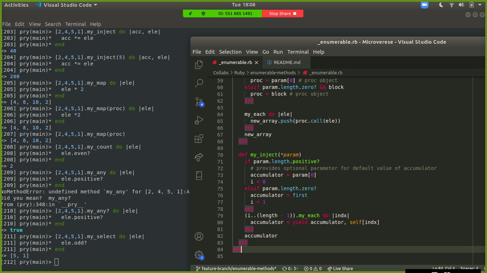

# Enumerable methods

> This project is our own implementaion of Ruby’s enumerable methods



## How to use this repo?

* Clone the repo
* Open the repo in terminal window
* Install ruby and pry 
```
$ gem install pry
```
* Open pry
```
$ pry
```
* Run the following comand
```
> load "enumerable.rb"
```
* Execute any of the methods available on an Array object
* Example
```
> [2,4,5,1].my_map do |ele|
    ele * 2
  end

=> [4, 8, 10, 2]

> [2,4,5,1].my_inject(5) do |acc, ele|
    acc *= ele
  end

=> 200
```

## Live Demo

[Live Demo Link](https://repl.it/@binii/Enumerablemethods)

## Built With

- Ruby

## Authors

👤 **Binyam Hailemeskel**

- GitHub: [@bini-i](https://github.com/bini-i)
- Twitter: [@binyamshewa](https://twitter.com/binyamshewa)
- LinkedIn: [LinkedIn](https://www.linkedin.com/in/binyam-hailemeskel-728048151/)

👤 **Dibyendu Das**

- GitHub: [@DibDas](https://github.com/dibdas)
- Twitter: [@DIBYEND78120480](https://twitter.com/DIBYEND78120480)
- LinkedIn: [Dibyendu Das](https://www.linkedin.com/in/dibyendu-das-b5967a1b1/)

## 🤝 Contributing

Contributions, issues, and feature requests are welcome!

## Show your support

Give a ⭐️ if you like this project!

## Acknowledgments

- Ruby docmentation
- [Ruby Guides](https://www.rubyguides.com/)

